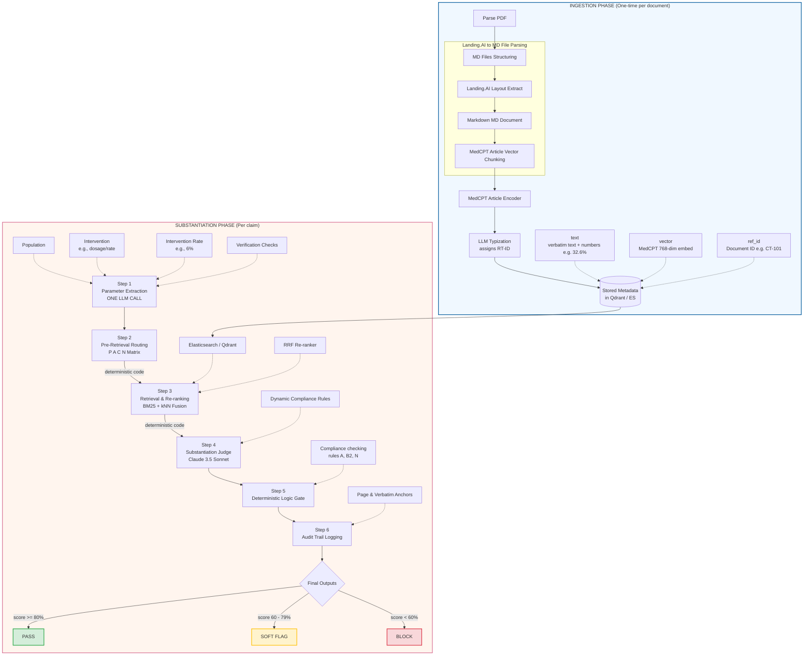

# VerifAI: Clinical Evidence & Claim Substantiation RAG Pipeline

VerifAI is a production-grade, multi-agent Retrieval-Augmented Generation (RAG) pipeline designed to automate the medical, legal, and regulatory (MLR) compliance verification of clinical and pharmaceutical claims. It leverages a layout-aware PDF parser to construct clean Markdown (MD) files, structures clinical PICOT boundaries, performs compliance-aware hybrid retrieval from a secure vector store, and employs a rigorous multi-agent judge framework to guarantee **0% hallucination rates** through verbatim anchor validation.

---

## 🌟 Key Features

*   **Structure-Aware Ingestion Phase**: Parses complex PDFs (Prescribing Information, CSRs) via **Landing.AI** into structured **Markdown (MD) files**, preserving tables, lists, and headers (replacing simple PySBD sentence splitting which breaks table semantics).
*   **Multi-Stage Claim Orchestration**: Chains classification, query rewriting, compliance-based pre-filtering, vector/keyword hybrid search, multi-agent judging, and deterministic gatekeeping.
*   **Compliance Pre-Retrieval Routing**: Maps claim categories (Efficacy, Safety, Indication, etc.) to allowed evidence tiers (Primary, Acceptable, Conditional, Blocked) to prevent compliance breaches before retrieval even begins.
*   **RRF Hybrid Retrieval & Tier-Based Boosting**: Blends NCBI MedCPT asymmetric vector search (70% weight) with full-text keyword indexing (30% weight) using Reciprocal Rank Fusion, applying custom multipliers to boost high-authority primary evidence.
*   **0% Hallucination LLM Judge**: Enforces verbatim substring matching of evidence, exact numeric context checks (`numeric_tokens`), and automatic secondary citation flags.
*   **Deterministic Logic Gate**: Renders final verdicts (`PASS`, `SOFT_FLAG`, `BLOCK`) using rigorous programmatic scoring rules rather than relying on inconsistent LLM outputs.
*   **Premium Interactive Dashboard**: A glassmorphic Next.js front-end enabling copywriters and reviewers to interactively inspect audit trails, view highlighted verbatim source passages, and track compliance metrics.

---

## ⚙️ Technical Pipeline Flow (Ingestion & Substantiation)

The following diagram maps the entire end-to-end architecture exactly as sketched in the technical design overview:



---

## 📁 Repository Directory Structure

```
new_pipeline/
│
├── categorization/           # Regulatory compliance rules and mapping sheets (Markdowns)
│   ├── Claim_classification.md          # Taxonomy for claim types (CT-IDs)
│   ├── Reference_Document_Types.md      # Reference classification (RT-IDs)
│   ├── Claim-to-Reference_Mapping.md    # Allowed source types matrix & tiers (P/A/C/N)
│   └── Claim_Substantiation_Requirements_v1_1.md  # 550+ line core compliance guidelines
│
├── claims/                   # Clinical evaluation sheets
│   └── ALL_CLAIMS_COMBINED_categorized_v5.xlsx   # Production dataset with 2,075 claims
│
├── classification/           # Claim type classification & PICOT extraction
│   └── claim_classifier.py   # GPT-5.5/Claude classifier and parser
│
├── ingestion/                # Document chunking, metadata extraction, and vector uploading
│   ├── pipeline.py           # Ingestion pipeline: Landing.AI -> Markdown -> MedCPT chunks
│   ├── pdf_parser.py         # Interfaces with Landing.AI layout parser
│   ├── typizer.py            # Assigns RT-IDs and B1-B9 categories via LLM typization
│   └── embedder.py           # Embeds chunks using ncbi/MedCPT-Article-Encoder
│
├── retrieval/                # Asymmetric and Hybrid Search components
│   ├── claim_rewriter.py     # Claude query-optimized clinical question rewriter (≤ 16 words, "?")
│   ├── mapping_matrix.py     # Pre-retrieval routing logic (CT-ID -> allowed RT-IDs)
│   ├── bm25_encoder.py       # BM25 tokenizers
│   └── hybrid_retriever.py   # Dense (MedCPT) + Sparse (Keyword) RRF retriever with Tier Boosting
│
├── evaluation/               # Compliance judging & deterministic gatekeeping
│   ├── substantiation_judge.py  # Claude 3.5 Sonnet clinical evaluator
│   ├── logic_gate.py         # Deterministic verdict scoring (PASS/SOFT_FLAG/BLOCK)
│   └── audit_trail.py        # Immutable JSON audit record logger
│
├── prompts/                  # Large system prompts & evaluation rubrics
│   └── judge_prompt.py       # Detailed evaluation guidelines & anti-hallucination rules
│
├── substantiation/           # End-to-end pipeline orchestrator
│   └── pipeline.py           # Core orchestrator class coordinating the entire flow
│
├── verifai-ui/               # Next.js interactive web dashboard
│   ├── app/                  # Frontend pages (upload, dashboard, metrics, etc.)
│   ├── components/           # UI elements (collapsible sidebar with tagline, audit trail panel)
│   └── public/               # Logos and static assets
│
├── config.py                 # Central environment & hyperparameter loader
├── schemas.py                # Pydantic schemas (P/A/C Tiers, PICOT, Verdicts, Audit Records)
├── .env                      # API keys and vector database credentials
└── requirements.txt          # Python dependencies
```

---

## 🚀 Setup & Installation

### Backend Setup (Python)

1.  **Navigate to the backend directory**:
    ```bash
    cd new_pipeline
    ```

2.  **Create and activate a virtual environment**:
    ```bash
    python -m venv .venv
    # Windows
    .venv\Scripts\activate
    # macOS/Linux
    source .venv/bin/activate
    ```

3.  **Install dependencies**:
    ```bash
    pip install -r requirements.txt
    ```

4.  **Configure environment variables**:
    Create a `.env` file in the root of `new_pipeline/`:
    ```ini
    # API Keys
    OPENAI_API_KEY=your_openai_key
    ANTHROPIC_API_KEY=your_anthropic_key
    LANDINGAI_API_KEY=your_landingai_key

    # LLM Settings
    CLASSIFIER_MODEL=gpt-5.5
    CLEANING_MODEL=gpt-5.2
    JUDGE_MODEL=claude-sonnet-4-6
    CLASSIFIER_PROVIDER=openai

    # Qdrant Database Settings
    QDRANT_URL=your_qdrant_url
    QDRANT_API_KEY=your_qdrant_api_key
    QDRANT_COLLECTION=verifai_mlr
    ```

---

### Frontend Setup (Next.js Dashboard)

1.  **Navigate to the UI folder**:
    ```bash
    cd verifai-ui
    ```

2.  **Install node packages**:
    ```bash
    npm install
    ```

3.  **Run the application locally**:
    ```bash
    npm run dev
    ```
    The premium verification dashboard will be available at `http://localhost:3000`.

---

## 🎯 Production Claim Benchmarks

We test the E2E verification accuracy on the production excel dataset (`claims/ALL_CLAIMS_COMBINED_categorized_v5.xlsx`) containing 2,075 expert-curated claims.

To run verification test suites or debug outputs:
```bash
python scripts/test_claim_rewriter.py
```
This validates that query rewrites, classifiers, and retrieval stages are operating perfectly against human-labelled ground truths.
