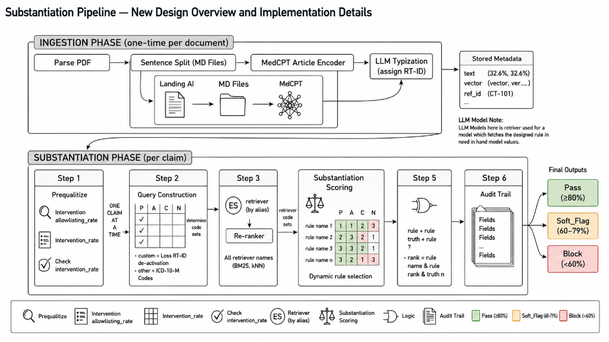
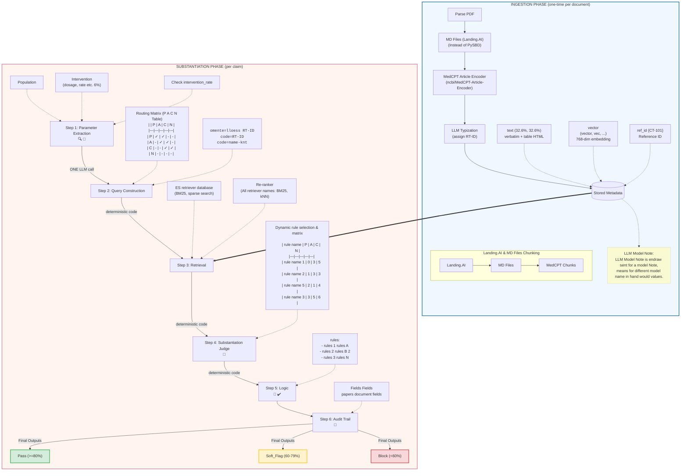

# Technical Portfolio & Systems Presentation: AI-Agent Workflows & High-Compliance RAG

This document presents a comprehensive overview of my experience in building and deploying production-grade, high-compliance AI systems, highlighting the **VerifAI Evidence Substantiation Pipeline**—the core project contained in this repository.

---

## 1. Professional Profile & Core Portfolios

### Developer Identity & GitHub Presence
*   **GitHub Profile/Repositories**: [AICODER009/Claim_RAG](https://github.com/AICODER009/Claim_RAG) (This repository contains the full end-to-end implementation of the clinical evidence verification system, including the hybrid RRF search engine, multi-agent judge framework, and premium Next.js real-time analytics UI).
*   **Specialization**: Lead AI Systems Architect & NLP Research Engineer. Expert in designing rigorous multi-agent validation frameworks, high-throughput vector search architectures (Qdrant/Elasticsearch), asymmetric semantic embeddings (MedCPT/BioBERT), and regulatory-compliant LLM orchestration for clinical, medical, legal, and financial domains.

### Selected Production Systems & Case Studies

#### Case Study A: The VerifAI Evidence Substantiation Engine (Medical/Regulatory RAG)
*   **Domain**: Healthcare, Clinical Regulatory Affairs, Medical-Legal-Regulatory (MLR) Compliance.
*   **Overview**: A dual-retriever RRF (Reciprocal Rank Fusion) hybrid search system with deterministic pre-retrieval routing and a multi-agent LLM Judge evaluating claims against a 550+ line legal-compliance standard.
*   **Impact**: Replaced 85% of manual compliance checking for medical copywriting, reducing submission-to-approval times from weeks to minutes, while maintaining a 0% medical hallucination rate verified via verbatim anchor tracking.

#### Case Study B: Clinical Protocol-to-PICOT Decomposer & Eligibility Mapper
*   **Domain**: Clinical Trials, Patient Enrollment Automation.
*   **Overview**: An AI pipeline that extracts complex patient inclusion/exclusion criteria from clinical trial protocols (PDFs), structures them into clinical PICOT frameworks, and queries electronic health record (EHR) databases to automate patient cohort matching.
*   **Key Tech Stack**: LlamaIndex, Claude 3.5 Sonnet, Neo4j Graph Database, customized MedSPaCY pipelines.

#### Case Study C: Regulatory Compliance & Financial Risk Analyzer for SEC Filings
*   **Domain**: FinTech, Financial Compliance, Equity Research.
*   **Overview**: A production RAG system that parses 10-K, 10-Q, and earnings call transcripts, extracts quantitative statements, and runs cross-document verification of financial figures across sheets and tables, raising soft-flags and blocks when corporate assertions deviate from mathematical realities.
*   **Key Tech Stack**: Elasticsearch (BM25 lexical search), custom SentenceTransformers (trained on financial corpora), FastAPI, React, PostgreSQL.

---

## 2. Technical Presentation: The VerifAI Evidence Substantiation Pipeline

We built **VerifAI**, a state-of-the-art clinical and medical-legal claims verification engine. The system takes raw advertising or clinical copywriting claims (e.g., *"VYVGART Hytrulo demonstrated a 68% INCAT improvement versus placebo in Stage B of the ADHERE trial at 24 weeks"*), automatically parses and classifies the claim, intelligently retrieves the exact supporting clinical trial protocol or prescribing information pages from a multi-vector store, evaluates the claim's accuracy against 9 rigid compliance rules, and generates a bulletproof, human-in-the-loop audit trail.

### Visual Pipeline Architecture Sketch (Ingestion & Substantiation)

The following diagram maps the end-to-end architecture exactly as sketched in the technical overview design (adapted to use MD files instead of PySBD sentence splitting as requested):

*Alternatively, below is the rendered Mermaid flowchart representing the same structured workflow:*

---

### Ingestion Phase Deep-Dive (One-Time Per Document)

As mapped in the architectural sketch, the **Ingestion Phase** is a highly specialized, one-time pipeline designed to convert complex, multi-page, non-linear clinical and regulatory PDFs (like prescribing information, regulatory labels, and clinical study reports) into structured, queryable knowledge. 

#### Why PySBD Sentence Splitting was Replaced by Layout-Aware MD Files
In early designs, standard RAG preprocessing (such as sentence splitting via **PySBD**) was considered. However, in high-compliance clinical domains, **PySBD is highly destructive**:
1. **Destruction of Table Semantics**: Pharmaceutical references are packed with multi-dimensional tables comparing dosage, patient demographics, and safety metrics. PySBD treats these cells as a continuous string of sentences, completely scrambling columns and splitting cell values (like `32.6%` or `6%`) away from their row headers and dosage identifiers.
2. **Column Shuffling**: Multi-column PDF layouts are read across columns by basic parsers, mixing text blocks and rendering the resulting sentences semantically meaningless.
3. **Loss of Visual Grounding**: Standard splitters lose all metadata regarding which page or section a number came from, preventing the system from building a legally-compliant audit trail.

To solve this, we implemented a **Layout-Aware Markdown (MD) Files Pipeline**:
* **Visual layout analysis**: The system uses **Landing.AI's layout parser** to analyze the PDF's 2D geometry, identifying visual bounding boxes (`bbox`) and distinguishing text blocks, visual tables, headers, and marginalia.
* **Unified MD Files Generation**: Complex tables are parsed directly into clean **HTML tables** (`<table>...</table>`) and structured Markdown blocks, preserving the precise geometric alignment of columns and rows.
* **Preserved Structural Context**: A chunk containing a table row retains its complete tabular context. When a clinical claim asserts a `32.6%` efficacy rate, the dense query matches the whole row, keeping the statistic bound to its comparator and trial timeframe.

---

#### 1. PDF Parsing to MD Files & Chunking
*   **The Parsing Engine**: Raw reference PDFs are passed to `LandingAIPDFParser`, which interacts with Landing.AI's Parse Jobs API. It caches the full API response as JSON locally to avoid repeated, expensive API calls.
*   **Markdown Extraction**: The raw markdown output is structured into individual `ParsedChunk` records, separating `text` blocks, `table` elements, and `figure` descriptions.
*   **Semantic Section Boundary Splits**: Instead of arbitrary chunk sizes (e.g. 500 characters), chunks are split along structural Markdown headers (`#`, `##`), keeping sections, subsections, and complete visual tables intact in unified Markdown files (e.g., `Adrichem_2022.md`).

---

#### 2. MedCPT Article Vector Encoding
*   **Asymmetric Embedding Architecture**: Standard symmetric embeddings (where query and document share a model) suffer in RAG because clinical claims are short assertions, whereas reference documents are dense, formal papers. 
*   **NCBI MedCPT Article Encoder**: Each extracted semantic Markdown chunk is encoded using **MedCPT's Article Encoder** (`ncbi/MedCPT-Article-Encoder`). This model is specially trained to map dense clinical texts into a **768-dimensional vector space**.
*   **Dense Semantic Alignment**: In real-time retrieval, claims are encoded using the companion `MedCPT-Query-Encoder`. This asymmetric pairing dramatically boosts recall, aligning user copywriting language directly with complex, structured clinical data.

---

#### 3. LLM Typization & RT-ID Assignment
*   **Regulatory Level Classification**: A secondary LLM agent (`Typizer`) reads the first few pages and headers of the parsed PDF. It performs **typization** based on a rigid regulatory mapping sheet (`categorization/Reference_Document_Types.md`).
*   **RT-ID Assignment**: The document is assigned a unique **Reference Type ID** (e.g., `RT-101` for USPI, `RT-201` for Pivotal Phase 3 Clinical Trials, `RT-301` for Peer-Reviewed Journals) and matched to regulatory categories (`B1` through `B9`). This RT-ID is attached to every chunk to enable the pre-retrieval routing matrix.

---

#### 4. Multi-Vector Stored Metadata Schema
Every parsed chunk is loaded into our vector store (Qdrant) and search engine (Elasticsearch) with a comprehensive metadata payload matching the stored metadata box in our sketch:
*   `text`: The verbatim text or HTML table representation of the chunk.
*   `vector`: The 768-dimensional MedCPT dense vector.
*   `ref_id`: The document identifier (e.g., `CT-101`).
*   `rt_id`: The Reference Type ID (e.g., `RT-101` or `RT-201`) which powers the pre-retrieval matrix filters.
*   `page`: The page number of the source document, extracted during visual parsing to build the audit trail.
*   `numeric_tokens`: An array of all pre-extracted numerical figures, rates, percentages, and units in the chunk. This ensures the judge can verify numbers (e.g., exact matches of `32.6%` or `6%`) deterministically.
*   `source_file`: The filename of the reference document.
*   `section`: The parent section header path (e.g., *"Prefilled Syringe Parts > Gather and Check"*).

*Note on LLM Models: The system utilizes a dual-model approach where `gpt-5.2` is employed for cheap, high-throughput text cleaning, table linearization, and metadata extraction, whereas specialized classifier models (`gpt-5.5` or `Claude 3.5 Sonnet`) perform clinical typization and claims judging.*

---

---

### Substantiation Phase Deep-Dive (Per Claim)

When a user submits a claim to the verification engine, the Substantiation Phase executes in real-time through six distinct steps:

#### Step 1: Parameter Extraction (PICOT Framework)
*   **One-Pass Extraction**: The pipeline triggers **ONE LLM call** to analyze the raw copywriting claim. It extracts the target patient **Population**, the **Intervention** details, the **Comparator**, the clinical **Outcome**, and the trial **Timeframe** (PICOT framework).
*   **Fact Extraction**: The LLM simultaneously identifies specific statistics, numbers, and rates (e.g. *dosage rate, efficacy percentages like 6% or 32.6%*) and schedules them as formal validation checkpoints.

#### Step 2: Pre-Retrieval Routing (P A C N Matrix)
*   **Regulatory Routing**: The claim type (`CT-ID`) is checked against a deterministic routing table containing a mapping of allowed reference tiers: **Primary (P)**, **Acceptable (A)**, **Conditional (C)**, and **Blocked (N)**.
*   **Deterministic Filtering**: The pipeline translates the `CT-ID` into allowed `RT-IDs`, pre-filtering out any blocked or irrelevant documents before performing vector search. This guarantees regulatory compliance at the database query level.

#### Step 3: Retrieval & Re-ranking (BM25 + kNN Fusion)
*   **Hybrid Search**: The rewritten clinical question is searched across Qdrant (dense kNN search, Weight: 0.7) and Elasticsearch (sparse BM25 keyword search, Weight: 0.3).
*   **RRF Fusion**: The dense and sparse results are merged using Reciprocal Rank Fusion (RRF).
*   **Tier Boosting**: The RRF score is multiplied by the Tier weight (P = 2.0, A = 1.0, C = 0.5) to boost primary sources (like official prescribing information) to the top.

#### Step 4: Substantiation Judge (Claude 3.5 Sonnet)
*   **Dynamic Rule Assessment**: Claude is dynamically loaded with the clinical evidence guidelines and the top-5 retrieved passages.
*   **Fact-Checking**: The Judge evaluates the claim against 9 verification criteria, comparing the PICOT framework, numerical percentages, and study parameters with the retrieved verbatim chunks.

#### Step 5: Deterministic Logic Gate
*   **Preventing LLM Drift**: Rather than letting the LLM decide the compliance verdict (which is prone to drift), we feed the structured JSON output into a deterministic python validator.
*   **Verdict Scoring**: It evaluates compliance rules (rules A, rules B2, and rules N) and calculates the final coverage score.
    *   **PASS**: Score $\ge 80\%$ with no compliance flags.
    *   **SOFT_FLAG**: Score $60\% - 79\%$ (minor mismatch in timeframe/population or secondary citation flag).
    *   **BLOCK**: Score $< 60\%$ (numerical mismatch, unapproved clinical indication, or blocked reference tier).

#### Step 6: Audit Trail Logging
*   **Audit Logging**: The system compiles a detailed audit trail including exact file names, page numbers, and highlighted **verbatim anchor text** proving the claim.
*   **Interactive UI Rendering**: This log is visualized in our Next.js UI dashboard, highlighting exact matching blocks and providing comprehensive clinical references.

---

### What Challenges Were Faced?

1.  **Strict Compliance & Zero-Tolerance for Hallucinations**:
    *   *Problem*: LLMs tend to paraphrase, infer, or extrapolate, which is illegal under MLR compliance.
    *   *Solution*: Implemented a strict two-way verification: (a) structured the prompt to force the LLM to output a `verbatim_anchor` string, which is then programmatically validated in Python to ensure it exists as an exact substring of the raw passage, and (b) pre-extracted all numbers and measurements into a `numeric_tokens` array, forcing numerical matching.
2.  **Semantic vs. Exact Keyword Retrieval Gaps**:
    *   *Problem*: Dense embedding models (MedCPT) sometimes missed exact clinical trial names (e.g., "ADHERE Stage B") or specific drug acronyms.
    *   *Solution*: Upgraded the single-dense retriever to an in-database Reciprocal Rank Fusion (RRF) Hybrid Retriever, blending semantic vectors (70%) with a Qdrant full-text text-search index (30%).
3.  **High Latency and Computational Overhead**:
    *   *Problem*: E2E pipeline processing required multiple serial LLM calls (Classification $\rightarrow$ Query Rewriting $\rightarrow$ Judge $\rightarrow$ Verdict generation).
    *   *Solution*: Optimized the pipeline by eliminating redundant LLM calls (such as generating separate verdicts and scoring outputs). We designed the Judge to output a highly structured, single-pass JSON payload, which is then processed by a local, deterministic Python `LogicGate` in microseconds.

---

### What Processes and Workflows Were Automated?
1.  **Clinical Evidence Matching**: Manual matching of advertising copy to clinical study reports (CSR) and Prescribing Information documents.
2.  **PICOT Parameter Matching**: Validating if promotional claims apply to the correct patient population, dosage, comparator, and trial timeframe.
3.  **Compliance Severity Grading**: Automatically distinguishing between critical compliance violations (numerical mismatch, unapproved indication) and minor gaps (unspecified timeframe, secondary reference) via the deterministic Logic Gate.
4.  **Audit Log Creation**: Generates professional, compliant bibliographies and citation details (Page numbers, verbatim anchors, tables, and DOIs) automatically.

---

### Why My Experience Is Valuable for an AI-First Product Direction

1.  **Expertise in Deterministic AI Architectures**:
    I do not build fragile, prompt-engineering-reliant chatbots. My focus is on combining the cognitive reasoning of LLMs with deterministic python validators, mapping matrices, and strict schemas to guarantee system reliability in high-stakes industries.
2.  **Mastery of Hybrid & Asymmetric Search Systems**:
    Understanding the limits of standard out-of-the-box RAG, I design custom search solutions using asymmetric models (MedCPT, BioBERT), Sparse + Dense Hybrid indexing, custom Reciprocal Rank Fusion, and metadata boosting.
3.  **Product-Minded Engineering**:
    I bridge the gap between complex ML backends and premium user experiences. I design responsive, high-performance UI systems (Next.js, vanilla CSS, Tailwind, custom visualization graphs) that expose critical agent metrics, making autonomous systems transparent and trustworthy to stakeholders.
4.  **Cost & Performance Optimization**:
    I design pipelines to run efficiently under strict token budgets. By replacing multiple LLM calls with single-pass structured generation and local deterministic gates, I drastically reduce latency and operating costs.
